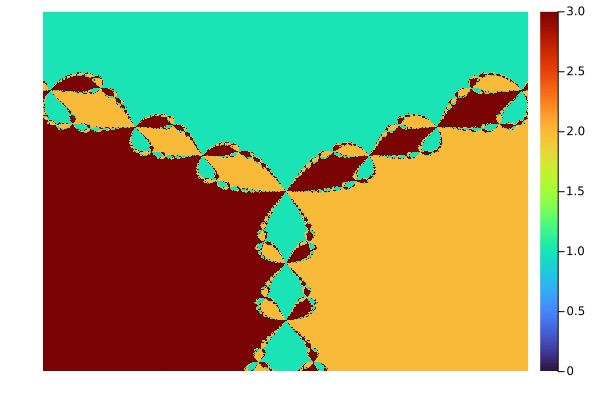
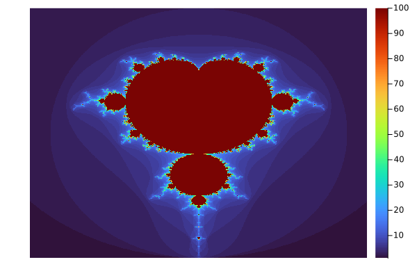
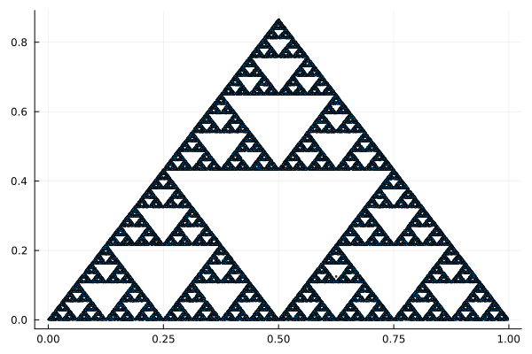

# Julia fractal lab

> Exploración de fractales, usando Julia.
> Dinámica compleja, caos, sistemas iterativos desde cero.

## Descripción.

Esto que estoy dejando acá es un laboratorio personal donde estaré explorando la generación de fractales mediante algoritmos matemáticos implementados en julia.

Mi intención con esto es lograr comprender:

- Números complejos
- Métodos numéricos
- Sistemas dinámicos
- Caos determinista
- Iteración y convergencia

## Fractales implementados.

- Nombre: Newton-Raphson
- Idea: Cada punto del plano converge a una raíz distinta.

```math
z_{n+1} = z_n - \frac{f(z_n)}{f'(z_n)}
```
**Resultado**



---

- Nombre: Mandelbrot Set
- Idea: determinar si una secuencia diverge o no

```math
z_{n+1} = z_n^2 + c
```

**Resultado**



---

- Nombre: Triángulo de Sierpinski
- Idea: generar un fractal mediante iteración de puntos hacia vértices de un triángulo (Chaos Game)

```math
p_{n+1} = \frac{p_n + v}{2}
```
Donde:

* ( p_n ) es el punto actual
* ( v ) es un vértice elegido aleatoriamente

### Qué está pasando

Este fractal no se dibuja directamente.

Surge a partir de una regla simple repetida muchas veces:
- elegir un vértice al azar
- moverse a la mitad de la distancia

A pesar del uso de aleatoriedad, el sistema converge a una estructura determinista.

Orden emergiendo del caos.

**Resultado**




## Conceptos aplicados.

- Iteración
- Convergencia / divergencia
- Derivadas
- Plano complejo
- Sensibilidad a condiciones iniciales
- Fronteras caóticas


## Stack

```text
julia version 1.12.6
Plots v1.41.6
```

Para ejecutar los algoritmos debe ser de la siguiente manera.

```bash
julia algoritmos/algoritmo.jl
```
##  Insight

Reglas simples + iteración → complejidad infinita.
Los fractales no se dibujan, emergen.